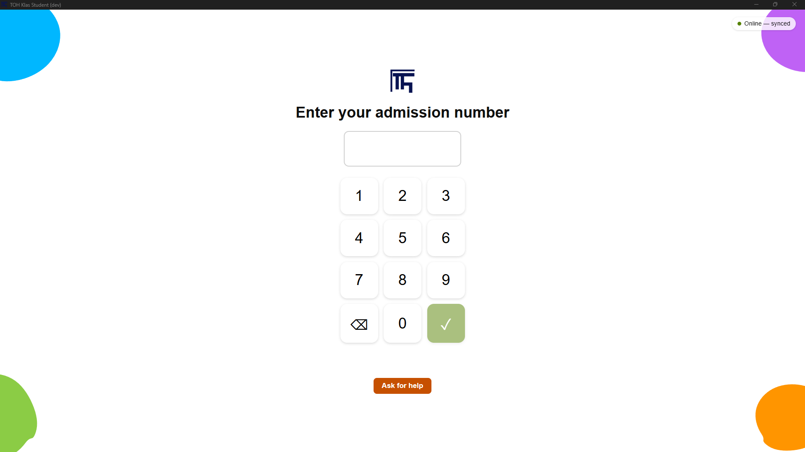
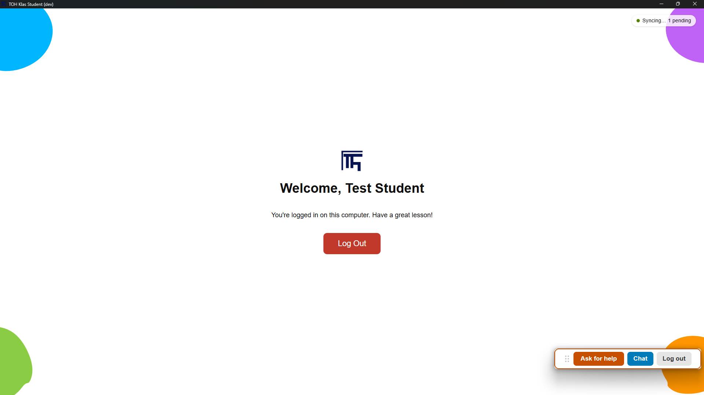
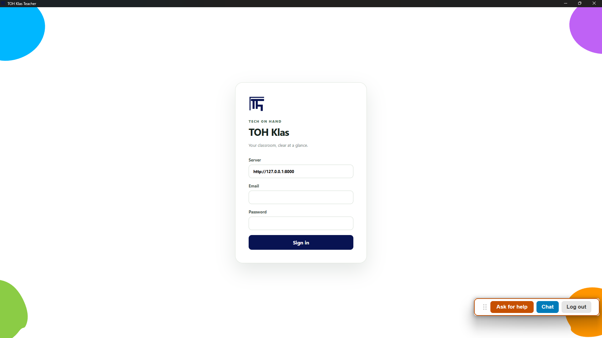
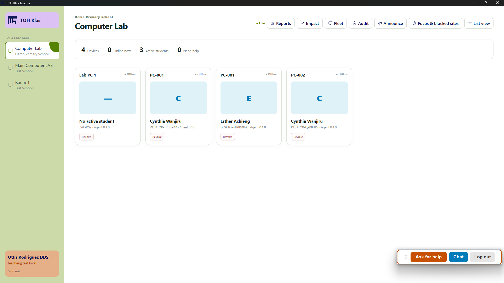
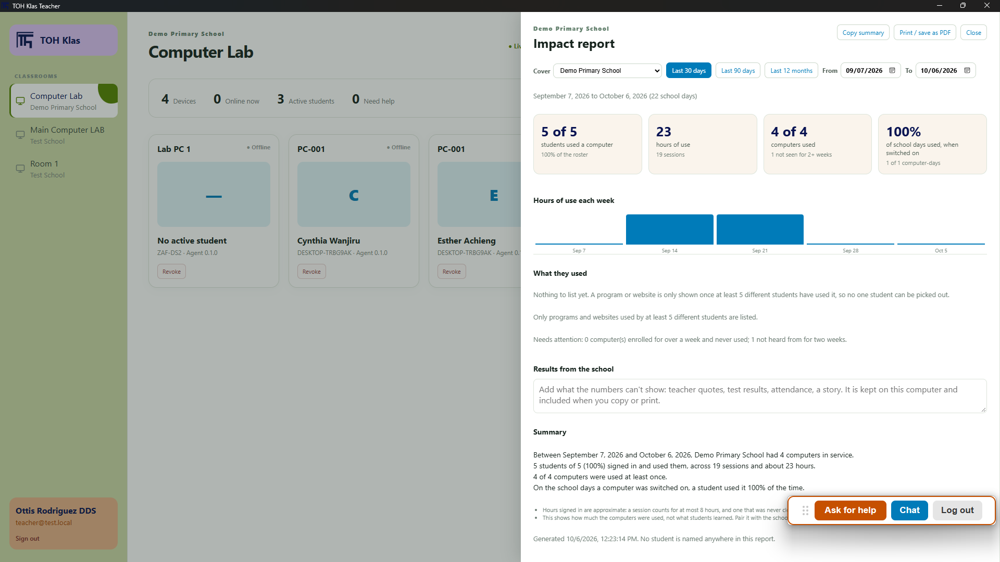
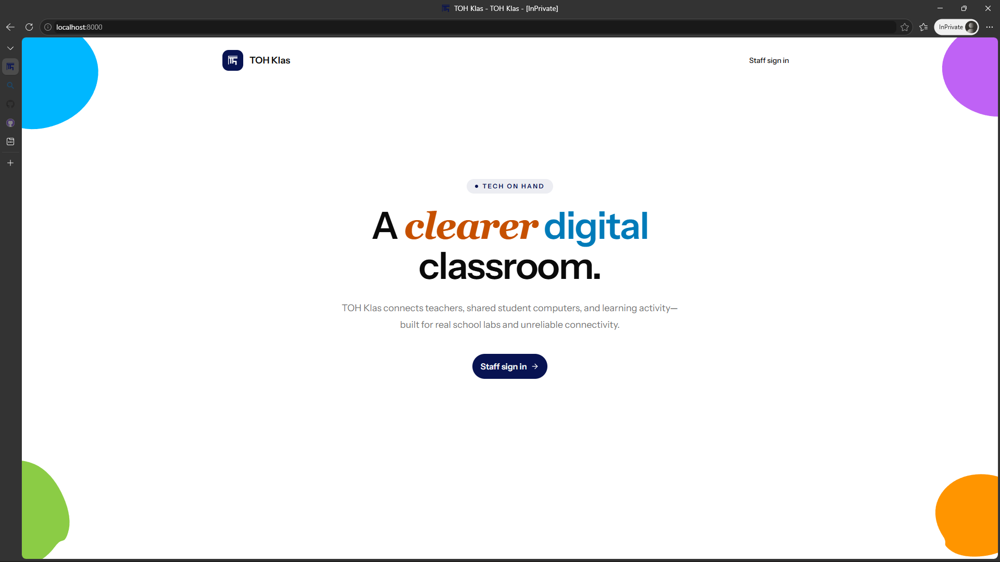
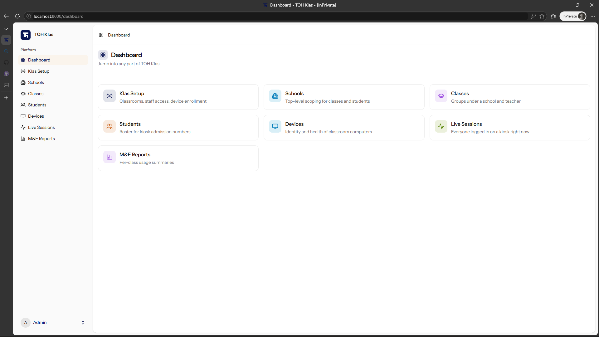
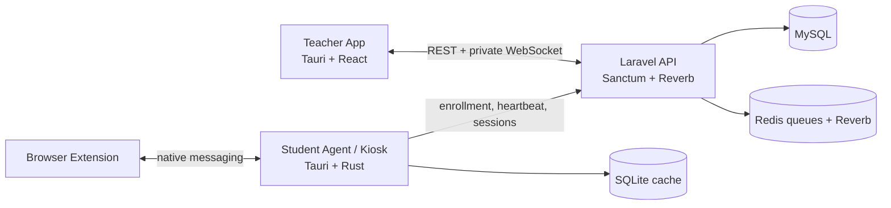

<p align="center">
  
</p>

<h1 align="center">TOH Klas</h1>

<p align="center">
  Classroom management software for <a href="https://techonhand.tech">Tech On Hand</a>'s donated computer labs.
</p>

---

Tech On Hand (TOH) provides retired and refurbished IT equipment and digital learning labs to underserved schools, primarily in Africa, giving students access to technology they otherwise wouldn't have. **TOH Klas** is the software that makes a lab of shared, donated computers usable in a real classroom: a teacher can see what's open on each student computer, limit which sites and apps are reachable during a lesson, and get basic usage reporting — built for real school labs and unreliable connectivity, not a polished office network.

## Screenshots

**Kiosk** — the student-facing app. Shown hidden behind the desktop while a student works; only a small floating bar (Ask for help / Chat / Log out) stays visible.

| Setup | Keypad login | Logged in |
| --- | --- | --- |
| _coming soon_ |  |  |

**Teacher dashboard** — what the teacher sees for their classroom.

| Login | Classroom view | Impact report |
| --- | --- | --- |
|  |  |  |

**Web admin** — school/org setup, rosters, and reporting.

| Landing page | Admin dashboard |
| --- | --- |
|  |  |

**Browser extension** — enforces the focus/blocklist policy a teacher sets.

| Blocked page |
| --- |
| _coming soon_ |

## What's in this repo

This is a monorepo: four components that ship and version together as one classroom system, maintained by one small team.

| App | Stack | What it does |
| --- | --- | --- |
| [`backend/`](backend) | Laravel 12 + Inertia + React, shadcn/ui, Tailwind v4, MySQL | The authority for tenants, schools, classes, students, devices, and permissions. Web admin panel + REST/WebSocket API the other three apps talk to. |
| [`kiosk/`](kiosk) | Tauri 2 + React + Rust | Runs on each shared student computer. Gates login behind an admission-number keypad, enforces focus/blocklist policy, and syncs session + activity data back to the backend. |
| [`teacher/`](teacher) | Tauri 2 + React | Runs on the teacher's own computer. Live view of the classroom's devices, screen-watch, chat, announcements, and focus-session control. |
| [`browser-extension/`](browser-extension) | Manifest V3, vanilla JS | Installed in the browser on each student computer. Enforces the site blocklist/focus policy the teacher sets, independent of the kiosk app. |

Also in this repo:
- [`browser-host/`](browser-host) — a small native bridge the extension and kiosk use to talk to each other on the same machine.
- [`provisioning/`](provisioning) — PowerShell scripts and docs for turning a bare Windows PC into a locked-down kiosk (OS-level hardening, not just the app).
- [`e2e/`](e2e) — end-to-end tests spanning multiple apps.

## Architecture



- **Laravel is the source of truth** for organizations, schools, classes, students, devices, and permissions — everything else is a client of it.
- **The kiosk retains its roster, current student session, and policy locally** (SQLite) so it keeps working through a connectivity drop, then syncs once back online.
- **The teacher app loads a REST snapshot before subscribing** to its classroom's private WebSocket channel, so a reconnect can't leave a permanently incomplete view.
- **Device presence** is asserted by a periodic authenticated heartbeat and expires if it stops.

Domain model: `Organization → School → { Classroom (physical room) → Device, Class (cohort) → Student }`, with a time-bounded `Student Session` linking a Student + Device + Classroom whenever someone's actually logged in. See [`toh-klas-architecture.md`](toh-klas-architecture.md) for the full picture, [`toh-klas-contracts.md`](toh-klas-contracts.md) for the API/event contracts between apps, and [`toh-klas-roadmap.md`](toh-klas-roadmap.md) for what's shipped vs. planned.

## Getting started

Each app runs independently. You'll generally want the backend running first, since the other three talk to it.

### Backend (`backend/`)

Requires PHP 8.3+, Composer, Node, and a MySQL database.

```bash
cd backend
composer run setup   # installs deps, copies .env, generates a key, migrates, builds assets
composer run dev      # runs the Laravel server, queue worker, scheduler, and Vite dev server together
```

Visit `http://127.0.0.1:8000`. For a real server rather than local dev, see [`backend/DEPLOYMENT.md`](backend/DEPLOYMENT.md) (Ubuntu server setup, systemd units, nginx, HTTPS); for turning a Windows PC into a locked-down kiosk, see [`provisioning/`](provisioning).

### Kiosk (`kiosk/`)

Requires Node and the [Tauri prerequisites](https://v2.tauri.app/start/prerequisites/) (Rust + platform build tools).

```bash
cd kiosk
npm install
npm run tauri dev
```

On first launch, use the setup screen's enrollment code (issued from the backend's Klas Setup page) to pair the device, or click **"Seed demo data (dev only)"** on a dev build to skip straight to a working demo roster.

### Teacher (`teacher/`)

```bash
cd teacher
npm install
npm run tauri dev
```

Sign in with a staff account that has access to at least one classroom.

### Browser extension (`browser-extension/`)

No build step — load it unpacked:

1. `chrome://extensions` → enable Developer mode → **Load unpacked** → select `browser-extension/`.
2. It communicates with the kiosk app running on the same machine via [`browser-host/`](browser-host).

## Design system

The brand (navy/blue/green/purple/orange, the bracket-shaped "TF" logo mark, the bold corner-blob background pattern) is deliberately white-first with bold accent color, not a tinted UI — color does the work of wayfinding, white stays out of the way of real classroom data. Each app defines the same brand tokens independently (no shared package across the four stacks), copied verbatim so they stay in sync.

## Contributing screenshots

Two are still missing — the kiosk's setup/enrollment screen and the browser extension's blocked page. If you're adding them, drop a full browser/app window (not a cropped widget) at:

```
docs/screenshots/
├── kiosk-setup.png        ← still needed
└── extension-blocked.png  ← still needed
```

and swap the corresponding `_coming soon_` cell above for an image tag.
