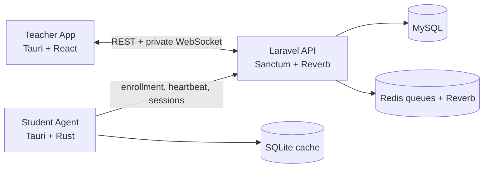

# TOH Klas Architecture

## Purpose

TOH Klas is a Windows classroom-management platform for shared school computers. It replaces the planned LanSchool dependency while retaining TOH Lens's proven offline identity gate and session synchronization.

The permanent identity is the **device**. A student's association with that device exists only through a time-bounded **student session**.

## Milestone 1 topology



- Laravel is the authority for tenants, permissions, classroom assignments, device identity, and revocation.
- The Student Agent retains its roster, current student session, and latest configuration locally when connectivity fails.
- The Teacher app loads a REST snapshot before subscribing to `private-classroom.{id}` so reconnects cannot leave a permanently incomplete view.
- Presence is asserted by a 30-second authenticated heartbeat and expires after 90 seconds.

## Domain boundaries

```text
Organization
  └─ School
      ├─ Classroom (physical room/lab)
      │   ├─ Device (permanent Windows computer)
      │   └─ Classroom staff roles
      ├─ Class (academic cohort)
      └─ Student

Student Session
  ├─ Student
  ├─ Device
  ├─ Classroom
  └─ Class (optional snapshot/context)
```

`computers` and `login_sessions` remain the physical table names during the compatibility period. New interfaces call them devices and student sessions.

## Security boundary

- Staff access is invitation-only and scoped by organization, school, and classroom membership.
- Device enrollment codes are SHA-256 hashed, single-use, classroom-scoped, and expire after 30 minutes.
- Exchanged device and teacher bearer tokens are revocable and stored in Windows Credential Manager, never exposed to React.
- WebSocket private-channel authorization repeats the same classroom/device checks as REST.
- Revoked devices are excluded from future command targeting even if an already-open socket takes time to close.

## Future architecture, not Milestone 1

- Chrome/Edge Manifest V3 extension communicates with a native host using length-prefixed UTF-8 JSON over Native Messaging.
- Commands use UUIDs, expiry, actor, tenant, target device, and optional student-session context. Student-specific commands require both `device_id` and `student_session_id`.
- Screen capture uses Windows Graphics Capture; WebRTC media is peer-to-peer where possible and uses TURN when required. Laravel/Reverb provides signaling, not media transport.
- A future LAN relay may carry the same versioned event/command envelopes. Cloud identity and audit records remain authoritative.
